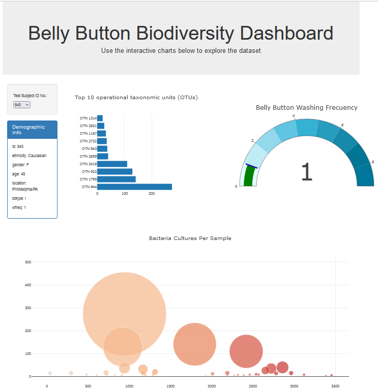
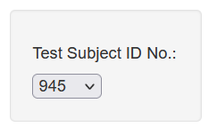
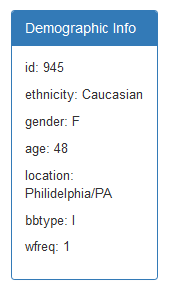
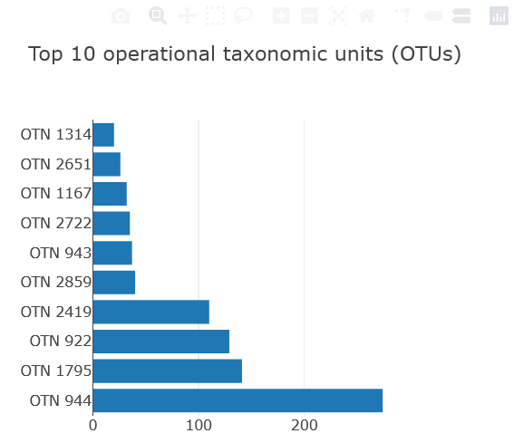
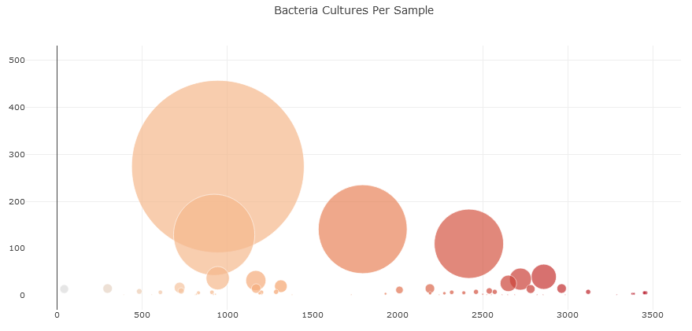
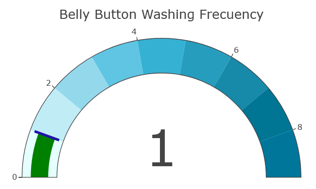

# plotly-challenge

# Plot.ly Homework - Belly Button Biodiversity

In this assignment, you will build an interactive dashboard to explore the [Belly Button Biodiversity dataset](http://robdunnlab.com/projects/belly-button-biodiversity/), which catalogs the microbes that colonize human navels.

The dataset reveals that a small handful of microbial species (also called operational taxonomic units, or OTUs, in the study) were present in more than 70% of people, while the rest were relatively rare.

## Elements:

1. A dropdown menu.

2. A table that display each key-value pair from the metadata JSON object somewhere on the page.

3. A horizontal bar chart with a dropdown menu to display the top 10 OTUs found in that individual.

  

4. A bubble chart that displays each sample.
 

## Extra Element

1. A plot the weekly washing frequency of the individual.

## Deployment

The page in action: https://sunny419-hub.github.io/plotly-challenge/

## References

Hulcr, J. et al.(2012) _A Jungle in There: Bacteria in Belly Buttons are Highly Diverse, but Predictable_. Retrieved from: [http://robdunnlab.com/projects/belly-button-biodiversity/results-and-data/](http://robdunnlab.com/projects/belly-button-biodiversity/results-and-data/)

